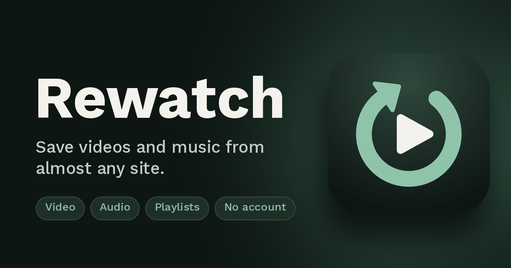

<div align="center">



<br><br>

# Rewatch

**Paste a link. Pick Video or Audio. Save it.**<br>
A self-hosted downloader for YouTube, TikTok, Instagram, X, Reddit and 1000+ more sites.

<br>

[](https://www.python.org/)
[](https://fastapi.tiangolo.com/)
[](https://github.com/yt-dlp/yt-dlp)
[](#-quick-start)
[](#-tests)
[](LICENSE)

[Quick start](#-quick-start) · [Features](#-features) · [Configuration](#-configuration) · [Sharing](#-share-it-with-a-cloudflare-tunnel) · [API](#-api) · [Security](#-security)

</div>

<br>

Rewatch is a rebuild of [ReClip](https://github.com/averygan/reclip) by averygan, with a
hardened API, live progress, friendlier wording and a fresh dark-green interface. It's made
for personal use on your own machine or home network, and you can share it through a
Cloudflare tunnel.

<br>

## ✨ Features

<table>
<tr>
<td width="50%" valign="top">

### 🎬 Video or Audio
Two big choices, no jargon. Video comes out as an H.264 + AAC `.mp4` that plays on
iPhone, Windows and TVs. Audio comes out as a `.mp3`.

</td>
<td width="50%" valign="top">

### 🏷️ Human-friendly quality
Pick **4K · 2K · Full HD · HD · SD** for video, or **Standard · High · Best** for audio.
Hover a chip to see the exact number.

</td>
</tr>
<tr>
<td valign="top">

### 📚 Playlists and batches
Paste up to 25 links at once. Playlist links expand into a list of videos, with a
single **Download all** button.

</td>
<td valign="top">

### 🖼️ TikTok slideshows
Photo posts open as a slideshow. Save them as one video with the music, or as separate
photos, one card each.

</td>
</tr>
<tr>
<td valign="top">

### ⚡ Live progress
Percent, speed and time left ("about 12 sec left") while it downloads, with a cancel button.

</td>
<td valign="top">

### 🎧 Cover art for audio
Audio cards keep the video thumbnail and add a small music-note badge, so you always
know what you're saving.

</td>
</tr>
<tr>
<td valign="top">

### 🧹 Tidy by default
Finished files are deleted from the server after 30 minutes. No accounts, no tracking,
no third-party requests.

</td>
<td valign="top">

### 🌏 English and ខ្មែរ
Switch language with the button at the top. Everything is translated, including error
messages, and your choice is remembered. First visits follow the browser language.

</td>
</tr>
</table>

<br>

## 🚀 Quick start

### Option A: Python

You need Python 3.10+, **ffmpeg** on your PATH, and **Deno** on your PATH for full YouTube
quality lists.

```bash
python -m venv .venv
.venv\Scripts\activate            # macOS/Linux: source .venv/bin/activate
pip install -r requirements.txt

cp .env.example .env              # Windows: copy .env.example .env
# open .env and set REWATCH_SECRET_KEY (see below)

python start_server.py
```

Open **http://localhost:8000**. The script also prints your LAN address so you can open
Rewatch from your phone.

```bash
python start_server.py --port 9000       # different port
python start_server.py --reload          # restart on code changes (development)
python start_server.py --tunnel          # also start a Cloudflare quick tunnel
python start_server.py --host 127.0.0.1  # this machine only
```

On startup it checks for ffmpeg (and exits if it's missing), warns if Deno or the secret
key is missing, and stops with a message if the port is already in use.

<details>
<summary><b>Install ffmpeg, Deno and a secret key</b></summary>

<br>

Windows:

```powershell
winget install Gyan.FFmpeg
winget install DenoLand.Deno
```

macOS: `brew install ffmpeg deno`

Generate a secret key:

```bash
python -c "import secrets; print(secrets.token_hex(32))"
```

</details>

### Option B: Docker

```bash
cp .env.example .env              # then set REWATCH_SECRET_KEY
docker compose up --build         # later runs: docker compose up -d
```

Open **http://localhost:8000**. The image already contains ffmpeg and Deno, and
`docker compose up` refuses to start until `REWATCH_SECRET_KEY` is set.

The compose file publishes the port on all interfaces, runs the container with
`no-new-privileges` and all capabilities dropped, and caps it at 2 GB RAM and 2 CPUs.
To reach it from this machine only, change the port mapping to `"127.0.0.1:8000:8000"`.

<br>

## 🌐 Share it with a Cloudflare tunnel

```bash
cloudflared tunnel --url http://localhost:8000
# or: python start_server.py --tunnel
```

This prints a `https://...trycloudflare.com` address.

> [!WARNING]
> Anyone with that address can use your instance. For anything beyond a quick test, use a
> named tunnel with **Cloudflare Access** (the free tier supports email one-time PINs)
> instead of relying on the address staying secret.

- Because the app also listens on your LAN, `REWATCH_TRUST_PROXY_HEADERS` is `false` by
  default, so all tunnel visitors share one rate-limit bucket. If you bind to `127.0.0.1`
  and reach the app only through cloudflared, set it to `true` so the limiter uses
  `CF-Connecting-IP`.
- Cloudflare's free proxy closes idle connections after about 100 s. The progress stream
  sends a keep-alive every ~15 s, and the page falls back to polling if it drops.

<br>

## ⚙️ Configuration

Set environment variables that start with `REWATCH_`, either in `.env` or in your shell.
[`.env.example`](.env.example) lists all of them with comments, and
[`app/config.py`](app/config.py) is the source of truth.

<details open>
<summary><b>Common settings</b></summary>

<br>

| Variable | Default | What it does |
|---|---|---|
| `REWATCH_SECRET_KEY` | random per start | Signs job tokens. Set it so open tabs survive a restart. Docker refuses to start without it. |
| `REWATCH_PUBLIC_URL` | *(from the request)* | Public address, e.g. `https://rewatch.example.com`. Used for the canonical link, share previews and `sitemap.xml`. |
| `REWATCH_TRUST_PROXY_HEADERS` | `false` | Trust `CF-Connecting-IP`, `X-Forwarded-For` and `X-Forwarded-Proto`. |
| `REWATCH_ALLOWED_HOSTS` | *(unset)* | Limit Rewatch to certain sites, comma-separated, e.g. `youtube.com,youtu.be`. |
| `REWATCH_PREFER_COMPATIBLE_CODECS` | `true` | Prefer H.264 + AAC so videos play everywhere. |
| `REWATCH_AUDIO_BITRATE_KBPS` | `192` | Default audio quality. |

</details>

<details>
<summary><b>Limits and timing</b></summary>

<br>

| Variable | Default | What it does |
|---|---|---|
| `REWATCH_MAX_CONCURRENT_DOWNLOADS` | `2` | Parallel downloads. |
| `REWATCH_MAX_QUEUED_JOBS` | `50` | Reject new jobs beyond this (HTTP 429). |
| `REWATCH_MAX_PLAYLIST_ITEMS` | `50` | Most videos taken from one playlist link. |
| `REWATCH_MAX_URLS_PER_BATCH` | `25` | Most links accepted at once (shown in the page). |
| `REWATCH_MAX_DURATION_SECONDS` | `14400` | Reject media longer than this (0 = off). |
| `REWATCH_MAX_FILESIZE_MB` | `2048` | Reject files larger than this (0 = off). |
| `REWATCH_RATE_LIMIT_PER_MINUTE` | `30` | Per-IP request limit (0 = off). `docker-compose.yml` sets 120. |
| `REWATCH_INFO_TIMEOUT_SECONDS` | `60` | Give up reading a link's details after this long. |
| `REWATCH_DOWNLOAD_TIMEOUT_SECONDS` | `1800` | Give up on a download after this long. |
| `REWATCH_FILE_TTL_SECONDS` | `1800` | Delete finished files and jobs after this long. |
| `REWATCH_CLEANUP_INTERVAL_SECONDS` | `60` | How often the cleanup runs. |

</details>

<details>
<summary><b>Paths and advanced</b></summary>

<br>

| Variable | Default | What it does |
|---|---|---|
| `REWATCH_DOWNLOAD_DIR` | `./downloads` | Where files are written. The Docker image uses `/app/downloads`. |
| `REWATCH_STATIC_DIR` | `./static` | Folder with the web page. Leave it unless you moved it. |
| `REWATCH_ALLOW_PRIVATE_URLS` | `false` | Allow URLs that resolve to private or loopback addresses. Leave this off. |
| `REWATCH_DENO_PATH` | *(auto)* | Full path to Deno if it's installed somewhere unusual. |

</details>

With Docker, `docker-compose.yml` passes these through from `.env` (except the download
and static folders).

> [!NOTE]
> Jobs are held in memory, so Rewatch runs a **single worker**. Don't start it with
> `--workers` greater than 1.

<br>

## 🌏 Adding a language

All text lives in [`static/js/i18n.js`](static/js/i18n.js), in one block per language.
To add one, copy the `en` block, translate the values, add a button with
`data-lang="xx"` next to the others in `static/index.html`, and run the tests. They fail
if a key is missing or a `{placeholder}` doesn't match the English text.

<br>

## 🩺 Troubleshooting

| Problem | Fix |
|---|---|
| Only one or two low qualities show for YouTube | Install **Deno** and make sure `yt-dlp[default]` is installed (`pip install -U "yt-dlp[default]"`). The card shows a warning when this is the cause. |
| "Unsupported URL" or errors on a site that used to work | Update yt-dlp: `pip install -U "yt-dlp[default]"`. In Docker, rebuild with `docker compose build --no-cache`. |
| TikTok photo posts don't load | Make sure `gallery-dl` and ffmpeg are installed. |
| "Too many requests" (429) | You hit the per-IP rate limit. Wait a minute or raise `REWATCH_RATE_LIMIT_PER_MINUTE`. |
| "Job not found" after restarting | Job tokens reset when the secret key is random. Set `REWATCH_SECRET_KEY`. |
| "This download has expired" | Files are removed after `REWATCH_FILE_TTL_SECONDS` (30 minutes by default). Paste the link again. |
| "Port already in use" | Use `python start_server.py --port 9000`. |
| Audio or merging fails | ffmpeg is missing from your PATH. |
| A site needs a login or cookies | Not supported. Rewatch ignores yt-dlp config files on purpose. |

<br>

## 🔌 API

There are no public API docs. These are the endpoints the bundled page uses:

| Method | Path | Notes |
|---|---|---|
| `GET` | `/api/v1/config` | Page limits |
| `POST` | `/api/v1/info` | `{url}` returns title, thumbnail, duration, uploader and available qualities |
| `POST` | `/api/v1/playlist` | `{url}` returns the entry URLs (up to 50) |
| `POST` | `/api/v1/jobs` | `{url, format: "video"\|"audio", height?, audio_bitrate?, title?}` returns `{job_id, token}` |
| `GET` | `/api/v1/jobs/{id}?token=` | Current status |
| `GET` | `/api/v1/jobs/{id}/events?token=` | Server-Sent Events progress stream |
| `GET` | `/api/v1/jobs/{id}/file?token=` | Download the finished file |
| `DELETE` | `/api/v1/jobs/{id}?token=` | Cancel a queued or running job |
| `GET` | `/healthz` | Health check |

The `token` is an HMAC signed when the job is created. A job id alone can't be queried or
downloaded.

<br>

## 🔒 Security

- URLs must be `http(s)`, at most 2048 characters, and can't carry credentials. Hosts are
  resolved and rejected if they point at private, loopback or link-local addresses
  (SSRF guard).
- yt-dlp runs as a library, so a URL can never be read as a command-line flag.
- The Content-Security-Policy allows only same-origin scripts, styles and fonts, and the
  page uses no inline styles or handlers.
- The SSRF check resolves DNS once before yt-dlp fetches the page, so it can't fully stop
  redirect or DNS-rebinding tricks. Keep the instance behind Cloudflare Access or on a
  trusted network, and don't give it access to sensitive internal services.

<br>

## 🗂️ Project layout

```
app/
  main.py            app factory, security headers, static files
  config.py          REWATCH_* settings
  security.py        URL validation, job tokens, rate limiting
  schemas.py         request and response models
  routers/           media.py (info, playlist), jobs.py (jobs, SSE, file), deps.py
  services/          extractor.py (yt-dlp), slideshow.py (TikTok photos),
                     jobs.py (queue + store), cleanup.py
static/              index.html, js/ (app.js, i18n.js), css/, fonts/, icons/
tests/               pytest suite
start_server.py      launcher for running without Docker
Dockerfile, docker-compose.yml, docker-entrypoint.sh
```

<br>

## 🧪 Tests

```bash
pip install -r requirements.txt pytest httpx
python -m pytest -q
```

The suite has 59 tests. The download tests need ffmpeg and are skipped if it isn't
installed.

<br>

## 🙏 Credits

- [yt-dlp](https://github.com/yt-dlp/yt-dlp) does the actual downloading.
- [gallery-dl](https://github.com/mikf/gallery-dl) reads TikTok photo posts.
- [averygan/reclip](https://github.com/averygan/reclip) (MIT) is the project Rewatch is
  rebuilt from.
- [Kantumruy Pro](https://github.com/anagata-design/kantumruy-pro) by Sovichet Tep is the
  bundled font, under the SIL Open Font License 1.1
  (see [`static/fonts/OFL.txt`](static/fonts/OFL.txt)).

<br>

## ⚖️ Legal

Downloading media you don't hold the rights to may violate a platform's terms of service
or copyright law where you live. That's up to whoever runs the instance.

Released under the MIT license, see [LICENSE](LICENSE).

<div align="center">
<br>

Rebuilt by [Raaaemmm](https://www.raaaemmm.tech), 2026.

</div>